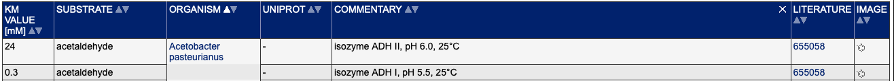

Extract from BRENDA
================
Sarah Torrence
October 12, 2020

This is the code to install the brendaDb package in R.

``` r
if (!requireNamespace("BiocManager", quietly = TRUE))
    install.packages("BiocManager")
BiocManager::install("brendaDb", dependencies=TRUE)
```

``` r
knitr::opts_chunk$set(echo=TRUE, warning=FALSE, message=FALSE)
#libraries
library(brendaDb)
library(data.table)
library(tidyverse)
```

    ## ── Attaching packages ─────────────────────────────────────── tidyverse 1.3.0 ──

    ## ✓ ggplot2 3.3.2     ✓ purrr   0.3.4
    ## ✓ tibble  3.0.4     ✓ dplyr   1.0.2
    ## ✓ tidyr   1.1.2     ✓ stringr 1.4.0
    ## ✓ readr   1.4.0     ✓ forcats 0.5.0

    ## ── Conflicts ────────────────────────────────────────── tidyverse_conflicts() ──
    ## x dplyr::between()   masks data.table::between()
    ## x dplyr::filter()    masks stats::filter()
    ## x dplyr::first()     masks data.table::first()
    ## x dplyr::lag()       masks stats::lag()
    ## x dplyr::last()      masks data.table::last()
    ## x purrr::transpose() masks data.table::transpose()

``` r
#downloading the database and reading it into R
brenda.filepath <- DownloadBrenda()
brenda <- ReadBrenda(brenda.filepath)

#writing the db to a text file
fwrite(brenda,file = "brenda.txt")

#reading in the db as a data.table
brenda_data <- fread("brenda.txt")
```

I wrote the database into a file and read that back in as a data.table
because it will be much quicker in the future than having to read in the
database everytime we want to use it using ReadBrenda().

The database is not a similar structure to how the website is laid out
so it isn’t intuitive how to query for the data we care about. For
example, there doesn’t seem to be a way to grab just the data in the
Functional Parameters section of the website.

Here is an example query of how to extract meaningful data from the
database. This example pulls out the information for the organism
“Acetobacter pasteurianus” from the EC number 1.1.1.1. I included this
example to show how we can relate the database to the actual information
on the website we are looking to extract.

``` r
example <- QueryBrenda(brenda_data, EC = "1.1.1.1", organisms = "Acetobacter pasteurianus")
ace <- example[["1.1.1.1"]][["parameters"]][["km.value"]]

ace %>% filter(fieldInfo == "acetaldehyde")
```

    ## # A tibble: 2 x 5
    ##   proteinID description fieldInfo    commentary                            refID
    ##   <chr>     <chr>       <chr>        <chr>                                 <chr>
    ## 1 61        0.3         acetaldehyde #61# isozyme ADH I, pH 5.5, 25°C <11… 113  
    ## 2 61        24          acetaldehyde #61# isozyme ADH II, pH 6.0, 25°C <1… 113



You can see these results have the same KM Value (‘description’) and
Commentary as we see in the table on the website and here ‘fieldInfo’ is
the Substrate.

I have not yet been able to determine if this is one-to-one mapping from
the table on the website as I found some results I do not see on the
website, but this is probably fine since we are just using the website
as reference.

Of course we want results for each enzyme across all organisms, but the
organisms are stored in a separate table in the database.

``` r
test <- QueryBrenda(brenda_data, EC = "1.1.1.1")
t_km <- test[["1.1.1.1"]][["parameters"]][["km.value"]]

organisms <- test[["1.1.1.1"]][["organism"]][["organism"]]

head(organisms)
```

    ## # A tibble: 6 x 5
    ##   proteinID description            uniprot commentary refID                     
    ##   <chr>     <chr>                  <chr>   <chr>      <chr>                     
    ## 1 1         Gallus gallus          <NA>    <NA>       44                        
    ## 2 2         Cricetulus griseus     <NA>    <NA>       1                         
    ## 3 3         Vicia faba             <NA>    <NA>       4                         
    ## 4 4         Drosophila melanogast… <NA>    <NA>       8,43,58,62,63,64,65       
    ## 5 5         Mus musculus           <NA>    <NA>       9,48,117,119,141,142,200,…
    ## 6 6         Thermus thermophilus   <NA>    <NA>       169,269

It looks like there is a ‘refID’ that is common between these tables so
we might have to join on this value. In the organisms table the variable
represents a list of reference IDs so we would have to do some cleaning
first.
