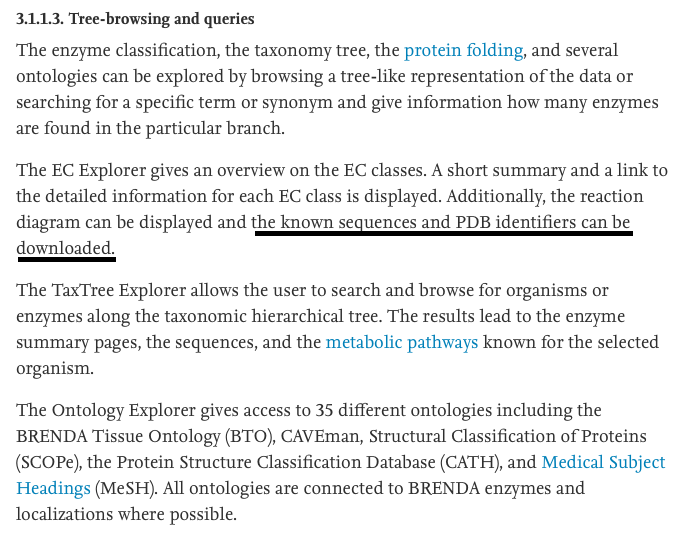

```{r, message = FALSE, warning = FALSE}
library(brendaDb)
library(data.table)
library(tidyverse)
library(stringr)
library(splitstackshape)
library(janitor)
library(readxl)

brenda_data <- fread("brenda.txt")

ex_ec <- QueryBrenda(brenda_data, EC = "1.1.1.1")
```

I first tried looking for PDB IDs in the brenda data base. I found some literature (https://www.sciencedirect.com/science/article/pii/S0168165617301839) that suggests you should be able to query for PDB in Brenda, but after doing a lot of searching I have not been able to find a way.

Here is a screenshot of the literature:



What is this description? I thought it might be PDB IDs but that doesn't seem to be true. Other than that I found nothing resembling a PDB ID.

```{r}
description <- ex_ec[["1.1.1.1"]][["molecular"]][["engineering"]]
```

# Sabio-RK

I searched for EC Number 1.1.1.1 in the Sabio-RK database and found 768 entries.

[ECNumber:"1.1.1.1"](http://sabio.h-its.org/newSearch/index)

There were too many entries for me to download them all in one file so I had to download the data in batches. Now I will have to read in the 4 separate files and combine them.

```{r}
sabio <- ""
file_names <- dir(path="./sabio_data")
for (i in file_names){
  file <- read_excel(paste0("./sabio_data/",i))
  sabio <- rbind(sabio, file)
}
sabio <- sabio[-1,]
```

Now we need to find the same information from Brenda for EC 1.1.1.1

```{r, warning = FALSE}
clean_column <- function(df, col_name){
  #cleans up a column that is a list of values so each cell has its own row
  
  #splitting up the values of the column
  df <- cSplit(df, splitCols = col_name , sep = ",", direction = "wide", drop = FALSE)
    
    #finding columns to input into the pivot_longer function
    param_columns <- names(df)
    columns <- param_columns[str_detect(param_columns, paste0("^",col_name,"_"))]
      
    #Transforming col_name into one column with one value for each row
    df <- df %>% pivot_longer(cols = columns, 
                                    names_to = "name", 
                                    values_to = paste0("new_",col_name), 
                                    values_drop_na = TRUE) %>% 
                               select(-name, -col_name)
}

extract_parameters <- function(ec, ls, parameters){
  #Extracts specified parameters for one EC, cleans up names and adds them to a new list
  
  #initializing the list
  param <- list()

  #iterate through all parameters needed
  for (i in parameters){
    
    #if the parameter is NA don't include it
    if (length(ls[[ec]][["parameters"]][[i]]) == 0 | is.na(ls[[ec]][["parameters"]][[i]])){
      break
    }
    else {
      #extract the parameter and clean up element names
      new_frame <- ls[[ec]][["parameters"]][[i]]
      names(new_frame)[2:4] <- c(i, "substrate", paste0(i,"_commentary"))
      
      #cleaning refID and proteinID so each row has one ID
      new_frame <- clean_column(new_frame,"refID")
      new_frame <- clean_column(new_frame,"proteinID")
      new_frame <- new_frame %>% select(refID = new_refID, proteinID = new_proteinID, everything())
      
      #append parameter to the list
      param <- append(param, list(new_frame))
    }
  }
  
  #return the list
  return(param)
}

join_parameters <- function(ls){
  #joins a list of parameter tables into one data table
  
  #converts each parameter into a data table
  ls <- lapply(ls, as.data.table)
  for (i in ls){
    setkey(i, proteinID, refID, substrate)
  }
  
  #join parameter data tables
  MergedDT <- Reduce(function(...) merge(..., all = TRUE, allow.cartesian = TRUE), ls)
  MergedDT <- clean_names(MergedDT)
}

extract_organisms <- function(ec, ls){
  #Extracts and cleans the organisms data for one EC
  
  #filtering for organisms
  organisms <- ls[[ec]][["organism"]][["organism"]]
  
  #cleaning variable names
  names(organisms)[2] <- "organism"
  
  #cleaning refID so each row has one ID
  organisms <- clean_column(organisms,"refID")
  organisms <- organisms %>% select(refID = new_refID, everything())
  
  organisms <- clean_names(organisms)
  organisms[, "protein_id"] <- lapply(organisms[, "protein_id"], as.integer)
  organisms <- as.data.table(organisms)
  
  return(organisms)
}

join_param_organisms <- function(parameters, organisms){
    #joins the parameters and organisms into one data table
  
    EC <- merge(organisms, parameters, by.x = c("protein_id","ref_id") , 
                 by.y = c("protein_id",  "ref_id"), all = TRUE, allow.cartesian = TRUE)
}

one_EC <- function(ec, ls, parameters){
  #cleans, joins and outputs a data table for one EC number

  param <- extract_parameters(ec, ls, parameters)
  
  #if the ECs has no parameter information assign it to NA
  if (length(param) == 0){
    return(NA)
  }
  else {
    param <- join_parameters(param)
    
    org <- extract_organisms(ec, ls)
    
    EC <- join_param_organisms(param, org)
  }
}

brenda_EC_data <- function(brenda_data, EC_list, parameters){
  #queries data from the brenda db for all desired ECs, processes the data and
  #outputs the data into one data table
  
  #querying data from the brenda Db
  ECs <- QueryBrenda(brenda_data, EC = EC_list)
  
  name <- list()
  out <- list()
  #iterating over all EC numbers and cleaning the data in a data table for each one
  for (i in 1:length(ECs)){
    o <- one_EC(names(ECs[i]),ECs, parameters)
    #if the EC is NA ignore it and move on
    if (is.na(o)){
      next
    }
    #appending each EC data table to a list
    name <- append(name, EC_list[i])
    out <- append(out, list(o))
  }
  names(out) <- name
  #merging all the data tables into one larger data table
  out_table <- rbindlist(out, use.names = TRUE, idcol = "ec", fill = TRUE)
  #filtering out rows where no valuable information is provided
  out_table <- out_table %>% filter((!is.na(km_value) & km_value != "additional information") |
                       (!is.na(turnover_number) & turnover_number != "additional information"))
  return(out_table)
}

parameters <- c("km.value", "turnover.number", "ki.value", "temperature.range", 
                "temperature.optimum", "ph.range", "ph.optimum")

brenda <- brenda_EC_data(brenda_data, "1.1.1.1", parameters)
```

The sabio-rk data for EC 1.1.1.1 has 769 rows versus the brenda data which has 1,985 rows. There is definitely more kinetics data in brenda than sabio-rk, but brenda is missing a lot of UNIPROTKBs. I want to check how many unique UNIPROTKB there are in each data set. 

Sabio-rk has some rows with multiple UNIPROTKB values in the same row so I need to clean this up.

```{r}
sabio <- cSplit(sabio, splitCols = "UniProtKB_AC" , sep = ";", direction = "wide", drop = FALSE)

sabio <- sabio %>% pivot_longer(cols = c(UniProtKB_AC_1,UniProtKB_AC_2), 
                                    names_to = "name", 
                                    values_to = "uniprot",
                                    values_drop_na = TRUE)
sabio$uniprot <- as.character(sabio$uniprot)
```

Now I can use the new `uniprot` column I created to see how many unique values are in each data set. 

```{r}
b_uni <- n_distinct(brenda$uniprot)

s_uni <- n_distinct(sabio$uniprot)
```

There are `r b_uni` unique UNIPROTKB values in the brenda db and `r s_uni` unique UNIPROTKB values in the sabio-rk db. With there being no difference in number of UNIPROTKB values, lets see if most of the UNIPROTKB values are the same between the two datasets.  

```{r}
b <- data.frame(uniprot = unique(brenda$uniprot))

s <- data.frame(uniprot = unique(sabio$uniprot))

dif <- anti_join(s, b, by = "uniprot")
```

There are quite a few differences between the UNIPROTKB values within the two datasets. I want to see if the data share the same PubMed ID for any instances. To do this I need to grab the PubMed ID from brenda and join it with the brenda data set for EC 1.1.1.1. 

```{r}
pubmed <- ex_ec[["1.1.1.1"]][["bibliography"]][["reference"]]

brenda$ref_id <- as.character(brenda$ref_id)

brenda <- left_join(brenda, pubmed, by = c("ref_id" = "refID"))
```

Now we can look at PubMed IDs between the two data sets.

```{r}
b_pubmed <- n_distinct(brenda$pubmed)

s_pubmed <- n_distinct(sabio$PubMedID)
```

There are `r b_pubmed` unique PubMed IDs in the brenda db and `r s_pubmed` unique PubMed IDs in the sabio-rk data set. Now let's check to see if any of these PubMed IDs are the same between the two data sets.

```{r}
b_pubmed_df <- data.frame(pubmed = unique(brenda$pubmed))

s_pubmed_df <- data.frame(pubmed = unique(sabio$PubMedID))

dif_pubmed <- anti_join(s_pubmed_df, b_pubmed_df, by = "pubmed")
```

There seem to be quite a few differences in PubMed IDs. Let's look at one in particular that is in both data sets as an example and see if the data looks similar between the two.

To look at parameter values in sabio-rk we need to clean up the `parameter.type` and `parameter.startValue` variables to have each parameter type in its own variable.

```{r}
sabio <- pivot_wider(sabio, names_from = parameter.type, values_from = parameter.startValue)
```

Now we can look at parameter values between the two data sets for the same PubMed ID.

```{r}
sim_pubmeds <- unique(inner_join(brenda, sabio, by = c("pubmed" = "PubMedID")) %>% select(pubmed))

ex_pubmed <- sim_pubmeds[[1,1]]

b_ex <- brenda %>% filter(pubmed == ex_pubmed) %>% 
  select(pubmed, organism, uniprot, km_value_commentary,km_value, turnover_number, ki_value) %>% unique()

s_ex <- sabio %>% filter(PubMedID == ex_pubmed) %>% 
  select(PubMedID, Organism, uniprot, Temperature, pH,kcat, Ki, Km) %>% unique()
```

```{r}
b_ex
s_ex
```

For PubMed ID `r ex_pubmed`, the organism, temperature and pH values look the same between both datasets. Further, none of these values in the brenda db have UNIPROTKB values but they all have UNIPROTKB values in the sabio-rk data. This means we could use the sabio-rk data to gather more UNIPROTKB values to add to the brenda data to make it more complete, but not many of the km, ki and kcat values are the same between the two data sets. It was hard to compare (I was doing it by eye), but I only found a couple matching values for this PubMed ID.

Another issue is finding a unique way to join the data from these two databases. As you can see there were a lot of duplicate values and no unique ID tying the two databases together. This is just one example of one PubMed ID and even in this example it was a bit messy for me to compare the two. I think the next step if we want to go down this route is to figure out if there is an easy way to combined these two data sources. There are other variables in sabio-rk that could help such as substrate, but I have not yet looked into any other variables than the ones shown here. 


